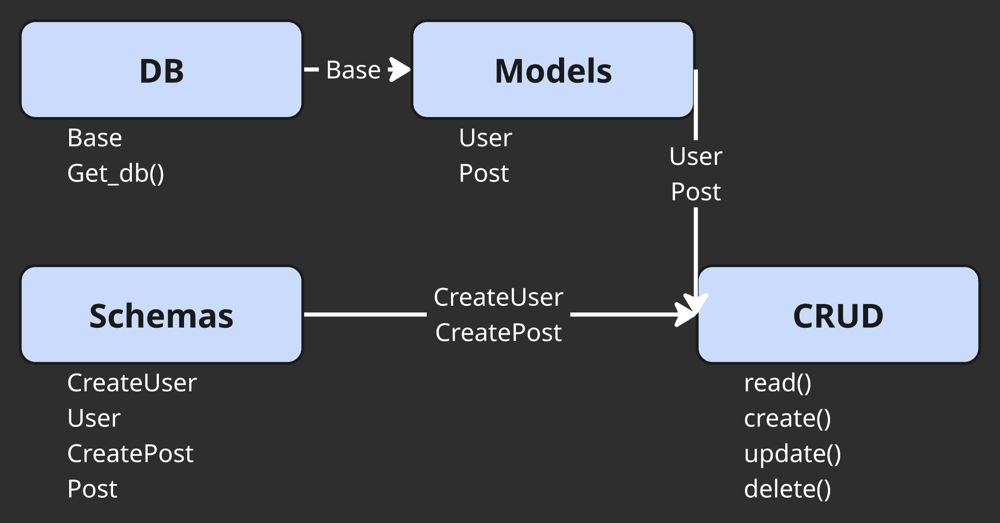
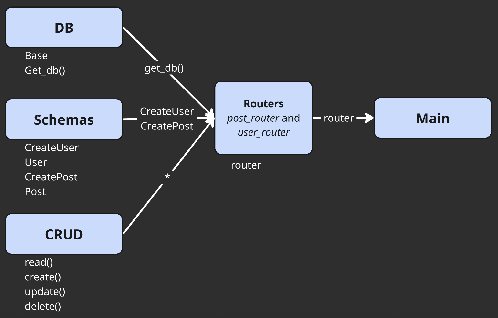

## Interaction schemas





## Database Models

```python
class User(Base):
    __tablename__ = "users"

    id = Column(Integer, primary_key=True, index=True)
    name = Column(String(25), nullable=False, unique=True, index=True)
    posts = relationship("Post", back_populates="user")


class Post(Base):
    __tablename__ = "posts"

    id = Column(Integer, primary_key=True, index=True)
    title = Column(String(50), nullable=False, index=True)
    text = Column(String(200))
    user_id = Column(Integer, ForeignKey("users.id"), index=True)
    user = relationship("User", back_populates="posts")
    time_create = Column(DateTime, index=True, default=lambda: datetime.utcnow())
```

